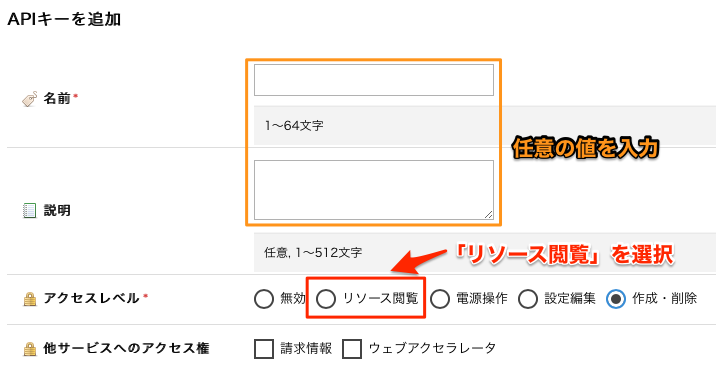
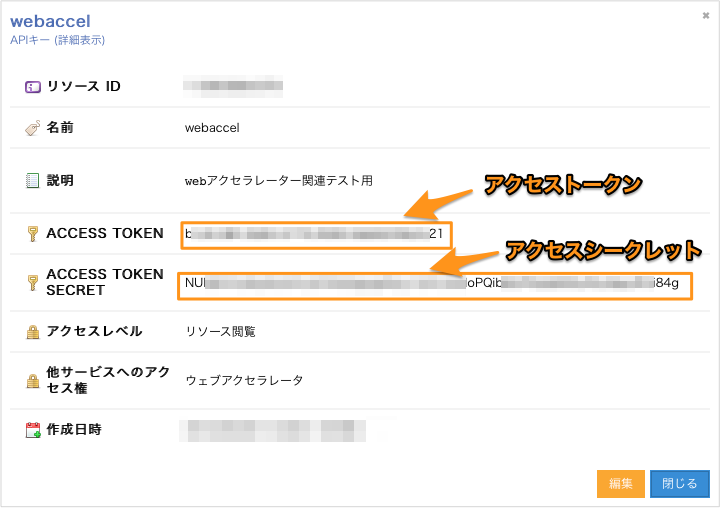

# Hanami導入ガイド

---

# 目次

  * [インストール](#_2)
  * [設定](#_3)

---

# インストール

### macOS / Linux

```bash
curl -fsSL https://releases.usacloud.jp/hanami/repos/install.sh | sh
```

> ※bash_completionを有効化するには上記コマンドを実行後に再ログインしてください。

`homebrew`または`linuxbrew`を利用している場合は以下でもインストール可能です。

```bash
brew tap sacloud/hanami
brew install sacloud/hanami
```

--- 

### Windows/その他の場合

以下のリンクからバイナリーファイルをダウンロードして展開し、任意のフォルダー内に配置してください。  
(PATHを通しておくと便利です)

- [https://github.com/sacloud/hanami/releases/latest/](https://github.com/sacloud/hanami/releases/latest/)

`bash_completion`が利用できる場合は、以下のコマンドで`usacloud`用の`bash_completion`を導入することが出来ます。

```bash
curl -s -L https://releases.usacloud.jp/hanami/contrib/completion/bash/hanami >> ~/.bashrc
```

> ※bash_completionを有効化するには上記コマンドを実行後に再ログインしてください。

---

### Dockerを利用する場合

`hanami`実行用イメージとして`sacloud/hanami`を公開しています。

```bash
# Dockerでのhanami実行例
docker run -it --rm \
    -e SAKURACLOUD_ACCESS_TOKEN \
    -e SAKURACLOUD_ACCESS_TOKEN_SECRET \
    sacloud/hanami -v
```

---

### whalebrewを利用する場合


Dockerイメージ`sacloud/hanami`は`whalebrew`でのインストール/実行に対応しています。

```bash
# インストール
whalebrew install sacloud/hanami
```

---

# 設定

`hanami`の実行にはさくらのクラウドのAPIキーの取得/設定が必要です。

## APIキーの取得

[さくらのクラウドのコントロールパネル](https://secure.sakura.ad.jp/cloud/)からAPIキーを発行します。

コントロールパネルにログインし、「さくらのクラウド(IaaS)」を選択します。


次に以下手順でAPIキーの追加画面を表示します。

  - (1) 画面右上の「設定」をクリック
  - (2) 左側に表示されるメニューから「APIキー」を選択
  - (3) 一覧の右上の「追加」をクリック


APIキーの追加画面が表示されたら、各項目を入力して「追加」をクリックします。

各項目は以下のように入力してください。

  - 名前 : 任意の名前を入力
  - 説明 : 任意入力
  - アクセスレベル : `リソース閲覧`を選択
  - 他サービスへのアクセス権 : チェックなし



APIキーを作成したら、以下の値を控えておいてください。

  - アクセストークン
  - アクセスシークレット



以上でAPIキーの取得完了です。

---

## APIキーの設定

APIキーは環境変数、またはコマンド実行時のオプションで指定します。

#### 環境変数で指定する場合

```bash
export SAKURACLOUD_ACCESS_TOKEN=<アクセストークン>
export SAKURACLOUD_ACCESS_TOKEN_SECRET=<アクセスシークレット>
```

#### コマンド実行時のオプションで指定する場合

```bash
hanami --token=<アクセストークン> --secret=<アクセスシークレット>
```

--- 

以上で設定終了です。
